# GitHub Actions Workflows Documentation

This document explains the automated workflows for scraping Substack content and publishing to Twitter.

## Workflow Architecture


## Workflow Files Overview

### 1. Content Scrapers

#### `substack-notes.yml` - Notes Scraper


**Triggers:**
- 🕐 Schedule: Every 5 minutes (`*/5 * * * *`)
- 🎯 Manual: `workflow_dispatch`
- 📝 Push: Changes to `substack-scraper/**`

**Key Features:**
- Uses PAT_TOKEN for authentication
- Installs both Python and Node.js dependencies
- Only triggers publishing if new content found
- Commits changes before triggering publisher

#### `substack-posts.yml` - Posts Scraper


**Triggers:**
- 🕐 Schedule: Every hour (`0 * * * *`)
- 🎯 Manual: `workflow_dispatch`
- 📝 Push: Changes to `substack-scraper/**`

### 2. Twitter Publishers

#### `publish-notes-to-twitter.yml` - Notes Publisher


**Triggers:**
- 🎯 Manual: `workflow_dispatch` (triggered by scraper or manually)

**Environment Secrets Required:**
- `TWITTER_API_KEY`
- `TWITTER_API_SECRET`
- `TWITTER_ACCESS_TOKEN`
- `TWITTER_ACCESS_TOKEN_SECRET`

**Key Features:**
- Reads `twitter.yaml` for premium mode setting
- Premium mode: Full content with formatting + images
- Free mode: 280 char truncation
- Creates `.published` markers to track published content
- Prevents duplicate posting

#### `publish-posts-to-twitter.yml` - Posts Publisher


**Same triggers and secrets as notes publisher**

### 3. Utility Workflows

#### `update-readme.yml` - README Updater


**Triggers:**
- 🔗 `workflow_run`: After scraper workflows complete
- 🎯 Manual: `workflow_dispatch`

## Content Structure

### Note File Structure
```
notes/
├── YYYY/
│   └── MM/
│       └── DD_note-{ID}/
│           ├── original_note.md      # Full note with frontmatter
│           ├── formatted_note.md     # Local image paths
│           ├── image1.jpeg           # Downloaded images
│           └── .published            # Marker file (if published)
```

**Note Markdown Format:**
```markdown
---
title: Note {note_id}
published: Mon, 17 Nov 2025 11:50:20 GMT
author: Cengiz Han
handle: hancengiz
url: https://substack.com/note/c-{id}
type: note
note_id: {id}
photo_url: {author_photo}
reactions: 0
restacks: 0
replies: 0
---
Everyone talks about human-in-the-loop.

I'm testing AI-in-the-loop.


```

### Post File Structure
```
posts/
├── YYYY-MM-DD_{slug}/
│   ├── original_post.md      # Full post with frontmatter
│   ├── formatted_post.md     # Local image paths
│   ├── image1.png            # Downloaded images
│   └── .published            # Marker file (if published)
```

## Twitter Publishing Logic

### Premium vs Free Mode

```mermaid
graph TD
    A[Read twitter.yaml] --> B{premium: true?}
    B -->|Yes| C[Premium Mode]
    B -->|No| D[Free Mode]

    C --> E[Format full content<br/>Convert markdown to Twitter format]
    E --> F[Bold → Unicode bold 𝗯𝗼𝗹𝗱]
    F --> G[Remove image markdown]
    G --> H[Upload images separately<br/>up to 4 images]
    H --> I[Post with media_ids]

    D --> J[Truncate to 280 chars]
    J --> K[Append link with 👉]
    K --> L[Post text only]

    style C fill:#90EE90
    style D fill:#FFB6C1
```



### Content Extraction Flow

```mermaid
flowchart TD
    A[Read original_note.md] --> B[Parse YAML Frontmatter]
    B --> C[Extract metadata<br/>title, author, url, etc]
    C --> D[Remove frontmatter<br/>using regex]
    D --> E[Remaining content<br/>is tweet body]
    E --> F{Premium Mode?}
    F -->|Yes| G[format_for_twitter]
    F -->|No| H[Use raw content]
    G --> I["Remove image markdown"]
    I --> J["Convert **bold** to 𝗯𝗼𝗹𝗱"]
    J --> K[Clean up links]
    K --> L["Add 👉 url at end"]
    H --> M[Truncate if needed]
    M --> L

    style G fill:#FFD700
```



## Concurrency Control

All workflows that commit changes use the `repo-updates-main` concurrency group:

```yaml
concurrency:
  group: repo-updates-main
  cancel-in-progress: false
```

This ensures:
- ✅ Only one workflow writes to the repository at a time
- ✅ Workflows wait in queue rather than conflicting
- ✅ No race conditions when committing

## Workflow Triggers Summary

```mermaid
gantt
    title Workflow Schedule
    dateFormat HH:mm
    axisFormat %H:%M

    section Notes
    Scrape Notes     :active, 00:00, 24h
    Publish Notes    :done, 00:05, 5m

    section Posts
    Scrape Posts     :active, 00:00, 1h
    Publish Posts    :done, 01:05, 5m

    section Utility
    Update README    :crit, 00:10, 2m
```



## Secret Requirements

### GitHub Secrets Needed

| Secret | Purpose | Used By |
|--------|---------|---------|
| `PAT_TOKEN` | Trigger other workflows | Scrapers |
| `TWITTER_API_KEY` | Twitter API authentication | Publishers |
| `TWITTER_API_SECRET` | Twitter API authentication | Publishers |
| `TWITTER_ACCESS_TOKEN` | Twitter API authentication | Publishers |
| `TWITTER_ACCESS_TOKEN_SECRET` | Twitter API authentication | Publishers |

## Configuration Files

### `twitter.yaml` - Twitter Settings
```yaml
twitter:
  premium: true  # or false for free mode
```

**Location:** `substack-scraper/twitter_publisher/twitter.yaml`

## Debugging

### Check Unpublished Content
```bash
# Find unpublished notes
find substack-scraper/notes -name "original_note.md" | \
  while read f; do
    dir=$(dirname "$f")
    [ ! -f "$dir/.published" ] && echo "$dir"
  done

# Find unpublished posts
find substack-scraper/posts -name "original_post.md" | \
  while read f; do
    dir=$(dirname "$f")
    [ ! -f "$dir/.published" ] && echo "$dir"
  done
```

### Manual Workflow Triggers
```bash
# Trigger notes scraper
gh workflow run substack-notes.yml

# Trigger posts scraper
gh workflow run substack-posts.yml

# Trigger notes publisher
gh workflow run publish-notes-to-twitter.yml

# Trigger posts publisher
gh workflow run publish-posts-to-twitter.yml
```

### View Workflow Runs
```bash
# List recent runs
gh run list --limit 10

# View specific run
gh run view <run-id>

# Watch live
gh run watch
```

## Error Handling

### Common Issues

1. **Workflow Cancelled**
   - **Cause:** Concurrency group conflict
   - **Solution:** Workflows now trigger sequentially

2. **No Twitter Credentials**
   - **Cause:** Missing secrets
   - **Solution:** Add all 4 Twitter secrets to repository

3. **Duplicate Posts**
   - **Cause:** Missing `.published` marker
   - **Solution:** Publishers check for marker before posting

4. **PAT Token Issues**
   - **Cause:** Insufficient permissions
   - **Solution:** Ensure PAT has `workflow` and `repo` scopes

## Maintenance

### Adding New Workflows

1. Create workflow file in `.github/workflows/`
2. Add to concurrency group if it commits to repo
3. Use PAT_TOKEN if it needs to trigger other workflows
4. Update this documentation

### Modifying Scraper Logic

1. Update `substack-scraper/scraper.py`
2. Test locally with `python scraper.py`
3. Commit changes (triggers workflow rebuild)
4. Monitor first automated run

### Changing Twitter Settings

1. Edit `substack-scraper/twitter_publisher/twitter.yaml`
2. Set `premium: true` or `premium: false`
3. Commit and push
4. Next publish will use new settings

## Architecture Decisions

### Why Separate Scraper and Publisher?

1. **Separation of Concerns:** Scraping and publishing are independent operations
2. **Error Isolation:** Publishing failure doesn't affect scraping
3. **Retry Logic:** Can retry publishing without re-scraping
4. **Manual Control:** Can manually trigger publishing

### Why Use PAT_TOKEN Instead of GITHUB_TOKEN?

1. **Trigger Workflows:** `GITHUB_TOKEN` cannot trigger other workflows
2. **Cross-Workflow:** PAT allows scrapers to trigger publishers
3. **Flexibility:** Can trigger workflows across repositories if needed

### Why Use `.published` Markers?

1. **Idempotency:** Prevents duplicate posts
2. **Tracking:** Records tweet ID and URL
3. **Resume:** Can resume after failure
4. **Audit:** Easy to see what's published

## Future Enhancements

- [ ] Add retry logic for failed publishes
- [ ] Support for Twitter threads (posts > 280 chars)
- [ ] Analytics tracking (engagement metrics)
- [ ] Scheduled deletion of old drafts
- [ ] Cross-posting to other platforms
- [ ] A/B testing tweet formats

---

**Last Updated:** 2025-11-17
**Maintained By:** GitHub Actions
