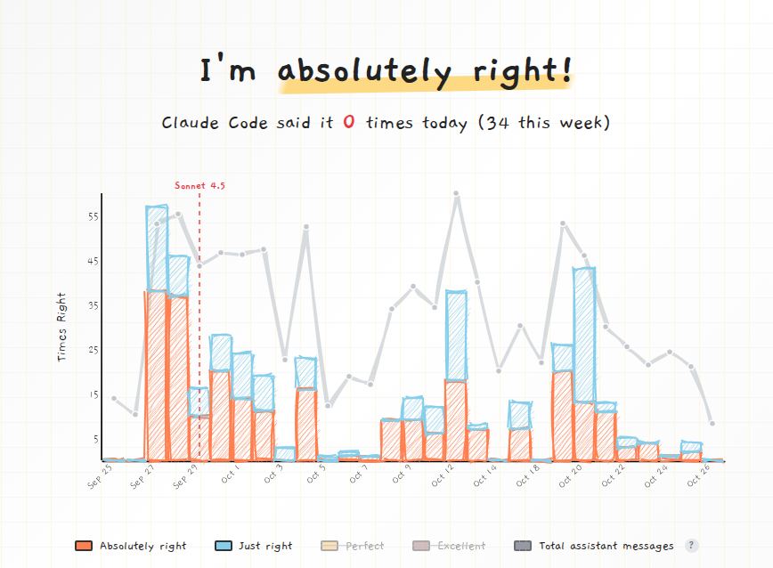

# Hi there, I'm Cengiz Han 👋

## About Me

Software Developer based in Istanbul, Turkey, specializing in cloud-native and serverless event-driven microservices. I'm passionate about building scalable backend systems, AI-native solutions, and modern distributed architectures. I focus on creating robust logging infrastructure, improving developer experience through automation, better tooling, and AI-native SDLC practices.

## 🎯 How Right Am I?

A fun experiment tracking how confident Claude Code is in my approaches! Check out the live stats at [cc.cengizhan.com](https://cc.cengizhan.com/)

*[Updated daily via GitHub Actions](https://github.com/hancengiz/hancengiz/actions)*

## 🚀 Currently Working On

- 🤖 Building AI-native solutions with spec-driven development
- ☁️ Designing serverless event-driven microservices on AWS
- 📝 Writing about observability, distributed systems, and modern SDLC practices
- 🔧 Exploring new tools and technologies to improve developer experience

## 💻 Tech Stack

### 🤖 AI-Native Development & SDLC

### ☁️ Cloud Platforms

### 🏗️ Distributed Systems & Event Streaming

### 📊 Observability & Monitoring

### 🐳 Container Orchestration & IaC

## 🎯 Areas of Focus

- 🤖 AI-Native Solutions & SDLC
- ☁️ Cloud-Native & Serverless Architectures
- 🎯 Event-Driven Microservices
- 🏗️ Backend Development & Distributed Systems
- 📊 Logging & Monitoring Infrastructure
- 🐳 Containerization & DevOps
- 🔧 Developer Tooling & Testing Frameworks
- ⚡ Message Queue Systems & Event Streaming

## Latest Blog Posts

### [Claude Claude, Don’t Be Mean—How Right Have I Been?](https://www.cengizhan.com/p/claude-claude-dont-be-meanhow-right)
*October 25, 2025*

You know what's funny about working with Claude Code? It's relentlessly encouraging. Every conversation feels like having a very supportive colleague who's genuinely excited about your ideas--sometimes to an almost comical degree.

### [The AI-Native Way of Building](https://www.cengizhan.com/p/the-ai-native-way-of-building)
*October 25, 2025*

TL;DR: The "spec-first" vs "ship-fast" debate is a dead end.   AI-native software teams don't win by rejecting process--they win by evolving it.   They know when to explore freely, when to specify what they've learned into structure, and when to...

### [Beyond Vibe-Coding: Spec-Driven Development](https://www.cengizhan.com/p/beyond-vibe-coding-spec-driven-development-80e80aade50e)
*July 28, 2025*

Vibe-coding is fun. You throw an idea at the AI, see what it spits out, tweak it, and repeat. For side projects, that's fine.

➡️ [Read more on my blog](https://www.cengizhan.com)
## Latest Notes

**[I automated my Substack notes to Twitter (complete...](https://substack.com/note/c-170364932)** · *October 26, 2025*

I automated my Substack notes to Twitter (completely free) Every time I publish a note here on Substack, it automatically posts to Twitter within 5 minutes. No Zapier, no Buffer, no manual copying. Just pure automation. How it works: 1\. GitHub...

---

**[Response to this comment : https://www.cengizhan.c...](https://substack.com/note/c-170317259)** · *October 26, 2025*

Response to this comment : https://www.cengizhan.com/p/the-ai-native-way-of- building/comments Even when I work alone, I still follow the BMAD Method or a similar approach I've designed. I usually start by "vibing"—exploring ideas, testing...

➡️ [See all notes](https://www.cengizhan.com/notes)
---

**[Response to this comment : https://www.cengizhan.c...](https://substack.com/note/c-170317259)** · *October 26, 2025*

Response to this comment : https://www.cengizhan.com/p/the-ai-native-way-of- building/comments Even when I work alone, I still follow the BMAD Method or a similar approach I've designed. I usually start by "vibing"—exploring ideas, testing...

➡️ [See all notes](https://www.cengizhan.com/notes)
---

**[Response to this comment : https://www.cengizhan.c...](https://substack.com/note/c-170317259)** · *October 26, 2025*

Response to this comment : https://www.cengizhan.com/p/the-ai-native-way-of- building/comments Even when I work alone, I still follow the BMAD Method or a similar approach I've designed. I usually start by "vibing"—exploring ideas, testing...

➡️ [See all notes](https://www.cengizhan.com/notes)
## 📊 GitHub Stats & Activity

### 🏆 GitHub Trophies

### 📈 GitHub Stats

### 🔥 GitHub Streak Stats

### 📉 Contribution Graph

## 🐦 Follow Me on Twitter/X

**Latest thoughts on AI-native development, serverless architectures, and modern SDLC**

[→ See my latest tweets](https://x.com/hancengiz)

## 🤝 Let's Connect

---

### *Building better systems, one commit at a time* 💻

*Embracing AI-native development to shape the future of software engineering*

**Thank you for visiting!** 🚀

