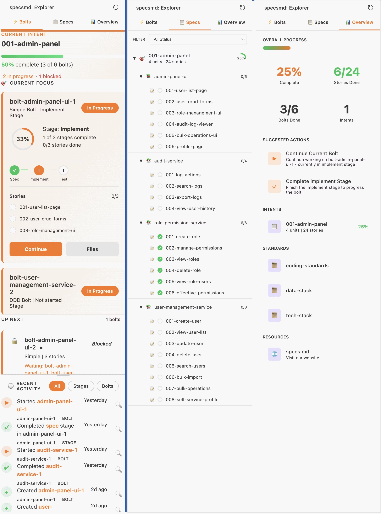

The specsmd VS Code extension is out.

Here's the problem it solves: your specs live in markdown files scattered across folders. To understand project status, you're opening file after file, scanning for what's done and what's next.

Now you get a dashboard in VS Code. All your intents, units, and stories in one view. Filter by status to see only what's in-progress or pending.

Focus on what matters next without the context switching.

<https://specs.md/getting-started/vscode-extension>

