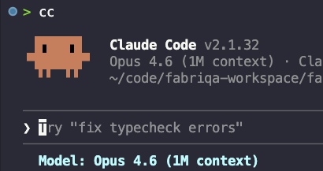

1M context window was not supposed to not be available in claude code. it is documented to be in the api and agents sdk. 

apperantly this works. /model opus\[1m\] (hope it does not try to compact 200k, since 1M context wid might not be ofically supported yet)

