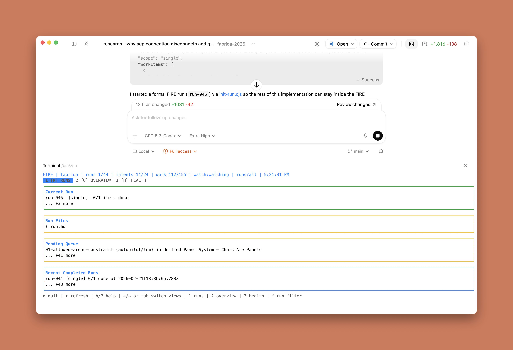
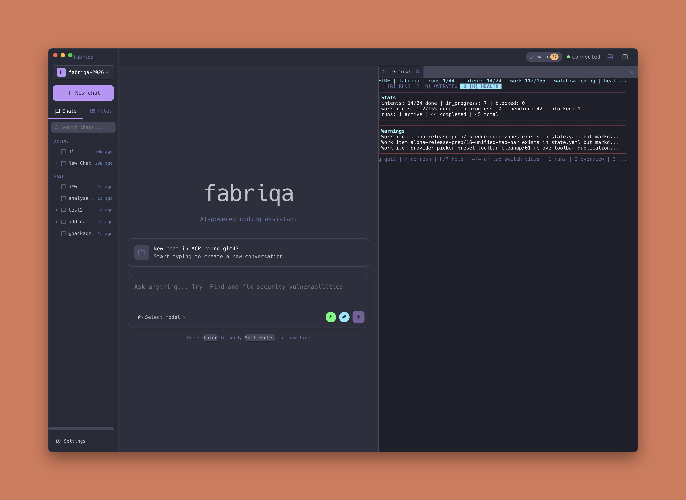
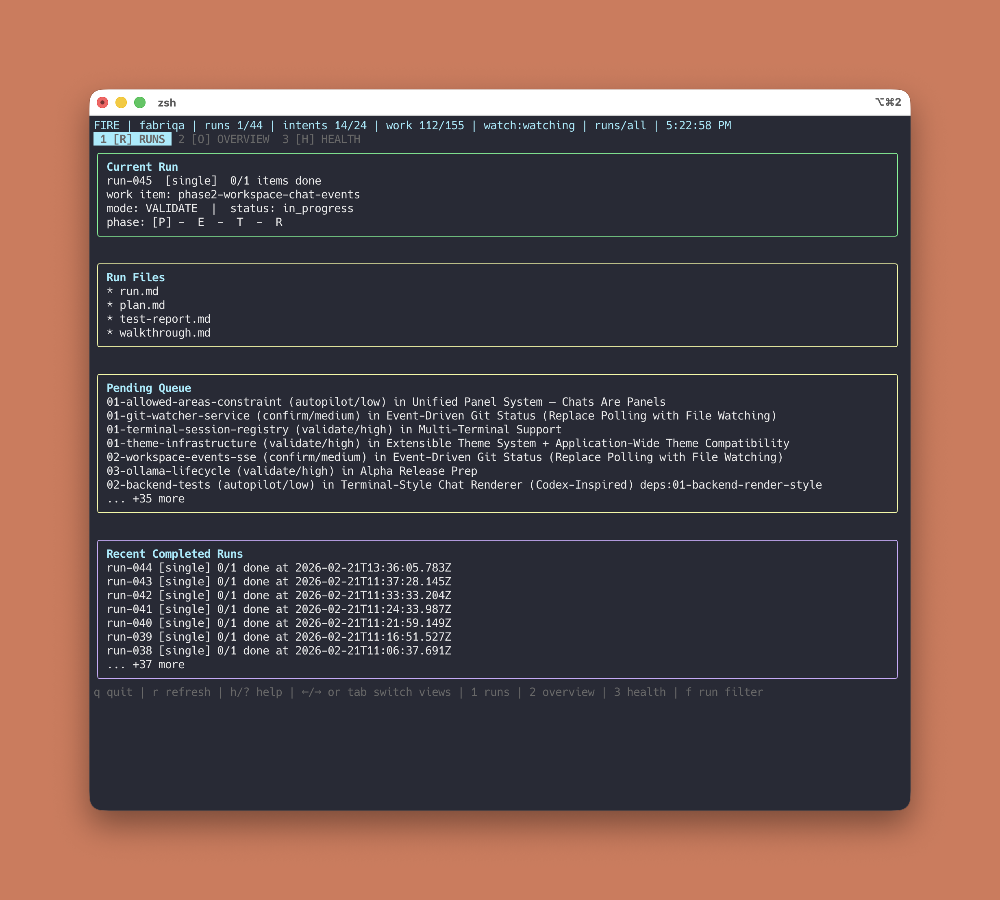

if you are using <http://specs.md> outside of vscode (or forks of it) you can use “npx specsmd@latest dashboard” command to bring a terminal compatible dashboard of the current state.  codex app, opencode, intellij, fabriqa desktop terminal windows or a standalone terminal

