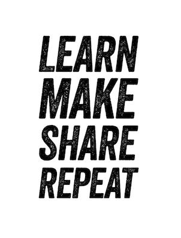

# Learn. Make. Share. Repeat.

**Published:** Sun, 03 Sep 2017 17:00:26 GMT
**Author:** Cengiz Han
**Link:** [https://www.cengizhan.com/p/learn-make-share-repeat-3b60bb60036f](https://www.cengizhan.com/p/learn-make-share-repeat-3b60bb60036f)

---

It's been a very long time since I blogged. I was meaning to start again for
the last a couple months, here it is I'm kicking it off.

I joined [Hepsiburada](https://www.linkedin.com/company/hepsiburada-com) 10
months ago after working at
[Thoughtworks](https://www.linkedin.com/company/thoughtworks) as a consultant
and a developer for six years. It has been a quite a good journey so far, I am
working with passionate individuals and great teams. I am facing different
challenges that helps me grow as a leader, architect and at the roots of it as
a developer.

I am currently working with data streaming and search systems heavily and
thinking about how to design a system that is going to support business growth
plans to serve our customer better by ensuring a fast, scalable and reliable
systems.

I will start blogging about architecture, system design and how to use some
open source technology I am in the process of learning, agile teams and
leadership. It will definitely not going to be limited to this because my
learning journey continues and I will try to reflect it here.

You can find me on :

[github](http://github.com/hancengiz) [twitter](http://twitter.com/hancengiz)
[linkedin](https://www.linkedin.com/in/cengizhan/)

* * *

[Learn. Make. Share. Repeat.](https://medium.com/hancengiz/learn-make-share-repeat-3b60bb60036f) was originally published in [cengiz
han](https://medium.com/hancengiz) on Medium, where people are continuing the
conversation by highlighting and responding to this story.
