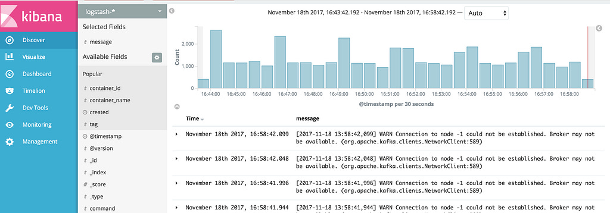
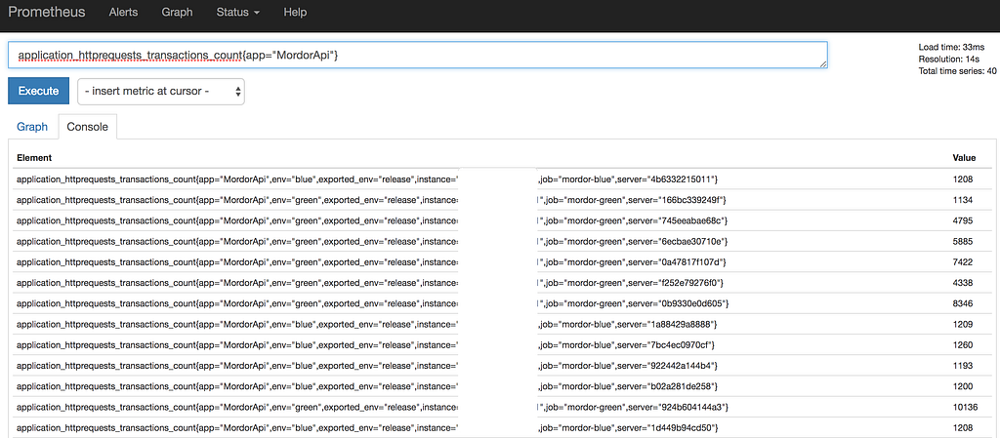
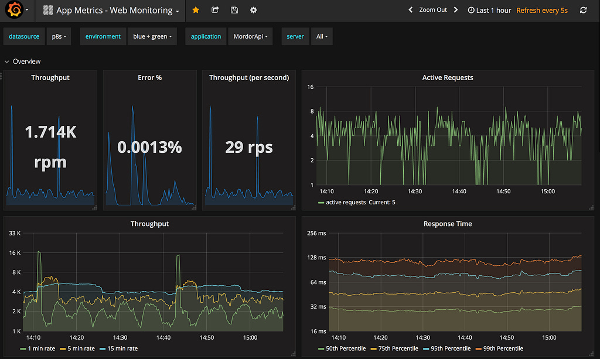
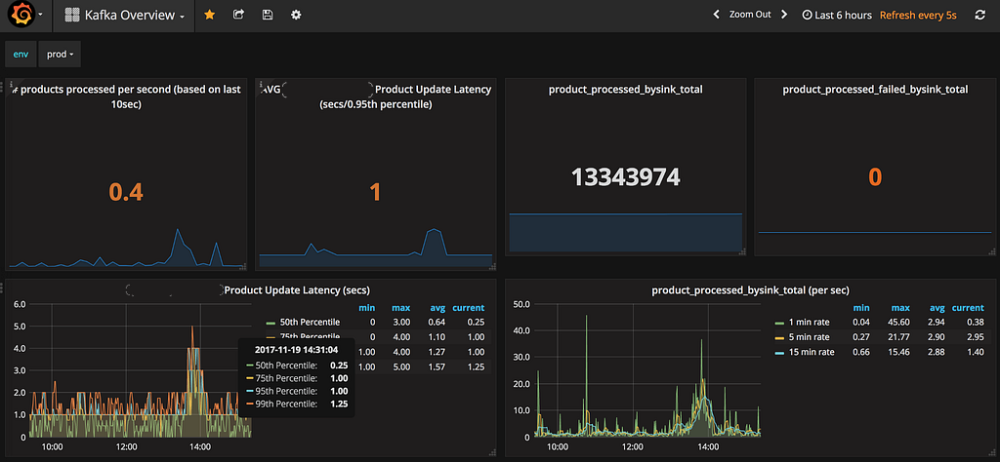
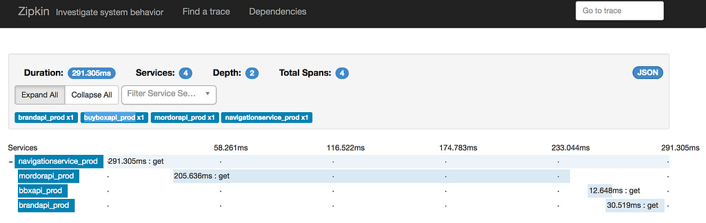

# 3 Pillars of Observability

**Published:** Sun, 19 Nov 2017 17:54:47 GMT
**Author:** Cengiz Han
**Link:** [https://www.cengizhan.com/p/3-pillars-of-observability-8e6cb5434206](https://www.cengizhan.com/p/3-pillars-of-observability-8e6cb5434206)

---

Observability of the system in production comes as a requirement when we
design complex systems. Some says being able to monitor your system in
production is more important than testing all of it's functionality during
development. To me, they are not really comparable things or you can give up
one of another.

Traditionally, if you have IT operations department in your organization you
probably have people who does **blackbox monitoring** with tools like Nagios.
What this tools give you are signals like _system is down, server/service is
down, CPU consumption high etc._ This is a must have and very good for
identifying the _symptoms_ of a problem but not the _root  cause_.

Once you get this symptoms telling you there is something wrong. You need to
dive deep and understand the root cause. **Whitebox monitoring** comes in to
the picture here. Whitebox monitoring can help you to identify root cause of a
problem and also more importantly can give you proactive alerting for the
possible preventable problems by looking at some tendencies on the system if
it is designed right. Because internals of an application can provide more
valuable and actionable alerts to take actions on critical cases or notice
things like performance problems to be more proactive and take actions before
things go down.

Logging, metrics and distributed tracing on the other hand are whitebox
monitoring that refers to a category of monitoring tools and techniques that
work with data reported from the internals of a system. I would like to write
about these 3 pillars of observability in the scope of whitebox monitoring.
When position these tools correctly you might not need to do blackbox
monitoring that often, but still good to keep them on if you ask me.

  *  _ **Logging**_

  *  _ **Metrics**_

  *  _ **Distributed Tracing**_

What are the differences of this three and how we accomplish this foundation
with these 3 pillars.

###  **Logging**

This is something probably the most systems I ever worked has implemented.

Logs are events happening in your system, these are detailed, prioritized
messages from your system. I think thinking of logs are events in your system
is not false idea.

The biggest drawbacks of logs is the expensive to process, store and ship.
They contain data for every single request that happened to your system. If
you are running your application on hundreds of servers you need to aggregate
them carefully to a central location otherwise it becomes impossible to check
them on each server.ELK is the most common stack here as you probably know.

By saying that, there are also some drawback of shipping all to logs to be
aggregated centrally. If you are dealing with huge volume of traffic and you
might need to think of what to ship, what not to ship (hint: correct logging
levels) also you need to have the right scale for your aggregation clusters,
in most cases elasticsearch cluster. It is not uncommon to have a cluster of
elasticsearch to aggregate all the logs and it fails to catchup when there is
a spike of logs on the days like Black Friday.

Libraries like SLF4J, log4j, log4net (there are lots of options depending on
the tech stack you are on) are being used to create formatted plaintext logs.
Most popular way of shipping your application logs is writing them to files on
the disk and shipping them to ELK with tools like FileBeat. But your
application can also ship your logs directly to your log aggregator. There are
lots of options you can evaluate for your case. Once I developed a log4net
appender which pushes logs as messages to amqp (we were using rabbitmq for
this) then we were using logstash to receive logs from rabbitmq and insert
them to elasticsearch then visualize with Kibana.

Recently we started to use Docker Engine to ship our logs. Docker added a
feature to ship logs to central log repositories like ELK stack. Most of
central logging repositories I know support Graylog Extended Log Format (GELF)
and I believe that is [how docker engine
ships.](https://docs.docker.com/engine/admin/logging/overview/#configure-the-default-logging-driver)

You can also get logs from your infrastructure tools. Most of the popular
message brokers (things like kafka, rabbitmq, nsq), HTTP reverse proxies, load
balancers, databases, firewalls, application servers, middlewares provide
their logs and you can ship them to your central log aggregators.

###  **Metrics**

Metrics are numbers that aggregatable and measured over intervals of time as
time series data. Metrics are optimized for storage, processing of the data
since they are just numbers aggregated over intervals of time.

One of the advantages of metrics based monitoring is overhead of metrics
generation and storage is constant, it does not change like logs based
monitoring in direct proportion to the increase of the system load. That means
Disk or processing utilization does not change based on the increase of
traffic. Disk storage utilization only increase based on data on time series
database being captured, which happens when you add new metrics' in your
instrumentation in your application code or when you spin up new
services/containers/hosts.

Prometheus (p8s) clients does not send each and every metric to the p8s.
Popular prometheus client libraries, for example Coda Hale's popular
[metrics](http://metrics.dropwizard.io/) library (and it is java but this
project direct ports to different languages) aggregates time series data in
your application process and generates metrics output based on in-process
calculations. I recommend watching [his presentation on
youtube](https://www.youtube.com/watch?v=czes-oa0yik) if you want to learn
more about his metrics library.

So, you need to add instrumentation to your application code first if you want
to start using Prometheus to collect metrics from your application. You can
find a list of [client
libraries](https://prometheus.io/docs/instrumenting/clientlibs/) on p8s web
site. Prometheus works pull based basically you use one of the available to
collect metrics in your application and then expose them on your application
as accessible via HTTP, generally /metrics endpoint in your application. Then
you go an configure prometheus to scrape metrics from your application every
few seconds.

Metrics are far more efficient than querying and aggregating log data. But
logs can give you exact data, if you want to get exact average of response
times of your server you can log them and then write aggregation queries on
elasticsearch. We have to member that metrics are not hundred percent
accurate, they relay on some statistical algorithm. Tools like Prometheus and
popular metrics client libraries implements some advanced algorithms to give
us most accurate numbers. Do not get me wrong! I am not saying use logs, I am
saying use both, logs and metrics for the right purpose.

Finally if you are want to learn Prometheus from strach and if you like
learning it from vides like me, I highly recommend this talk: [Infrastructure
and application monitoring using Prometheus by Marco
Pas](https://www.youtube.com/watch?v=5GYe_-qqP30)

Once you collect all your metrics in Prometheus, you can use
[Grafana](http://www.grafana.net) to visualize those metrics.

Metrics
on Prometheus

Prometheus
data visualized on Grafana

 **What should I  collect?**

Once you have the setup to collect your own this is the question you need to
answer. If you are adding metrics for a microservice;

Firstly, I would recommend you to start with capturing number of requests to
observe how busy your service is and how many requests you receive per
second/minute. **Number of  Requests**

Secondly, I would say start capturing your service's service time. Basically
duration of each request to capture what is your service's latency. **Service
Response  Time**

And, I would say capture number of erroneous requests to observe of what
percentage of the requests coming to your service are failing. **Error rate of
requests.**

Lastly, **always check %95 percentile** if you are not sure what percentile to
check. Mean time or average is a happy picture if you want to trick yourself.

There will be very specific cases for your application, these are just some
suggestions you can start to think of. For example in our last project we
wanted to measure ETL processing time of each product. We captured each
product's update rate in the underlying system and we calculated the time it
took to get to the end of the ETL pipeline. So this way we wanted to see if
there is a bottleneck in the Kafka based data streaming pipeline. This way we
could observe each stage of data streaming pipeline to identify bottleneck and
provision new Kafka Streams containers or Kafka Connect containers when
needed.

Monitoring
product update latency on our Kafka data streaming pipeline.

Logs and metrics both needs to exists in your application monitoring stack and
they need to be owned by the your team to build, not an IT Ops team. Logs can
give you insight about each single request and look for details of what
happened exactly at a specific time but metrics can show you context and
understand trends in our system.

###  **Distributed Tracing**

When logs can give you insight about a specific time and see what happened it
is hard to correlate them when you are building a distributed system.
Especially in the era of microservices, a request from a customer can cause
hundreds of different service calls in your application.

Monitoring calls that took longer than expected, call that are failed, why
they are failed can be hard to do with logs. Also finding matching logs with a
unique request id is something you can accomplish but it would still be hard
to query slowest calls that my customers faced.

Google published a paper with the title
**[Dapper](https://research.google.com/pubs/pub36356.html)**[, a Large-Scale
Distributed Systems Tracing
Infrastructure](https://research.google.com/pubs/pub36356.html) at 2010. They
talked about how they trace distributed calls. June 2012 Twitter open sourced
their internal distributed tracing project,  **Zipkin**.

So if you are in the world of microservices and working on distributed system,
you can imagine how valuable to have a visual of correlated distributed calls
between services. I tried Zipkin in it's early years and it was not easy to
setup but now in the era of container, it is just one single command. But
everyone was not using it and still not using probably.
[OpenTracing](http://opentracing.io/) was introduced as one single standard as
all OSS projects and your application code to instrument your code without
depending on one particular tracing vendor.

So now, you can use one of the [listed](http://opentracing.io/) open source
client libraries to instrument your code and publish this span information to
one of the supported
[tracers](http://opentracing.io/documentation/pages/supported-tracers.html)
([Zipkin](http://zipkin.io/), [Jaeger](http://uber.github.io/jaeger), Appdash,
LightStep, Hawkular, Instane and more).

If you remember your browsers developer tools and check network tab which
calls are being made, it gives you very good insight about what your browsers
does, which calls are made in parallell, which ones are taking too long to
process and makes your customer wait. Distributed tracers gives you this kind
of visualization, on server side.

For example, you can see which of your services being called, which ones take
longer than expected or which ones fail when you receive a request to get list
of products under a specific category, order by prices.

Zipkin interface let's you query by longest and shortest duration of call
stack. So you can focus on your low performing calls and understand which part
of the system being a bottleneck. You can also get visualization of
dependencies between services which becomes very valuable when you have
hundreds of systems talking to each other.

A
detailed view of a Zipkin trace

* * *

[3 Pillars of Observability](https://medium.com/hancengiz/3-pillars-of-observability-8e6cb5434206) was originally published in [cengiz
han](https://medium.com/hancengiz) on Medium, where people are continuing the
conversation by highlighting and responding to this story.
