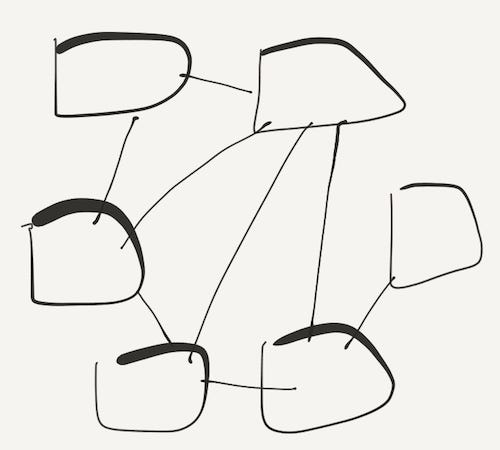
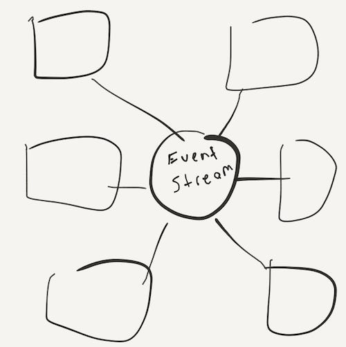

# (Micro)services with Event Notifications

**Published:** Mon, 25 Feb 2019 09:25:56 GMT
**Author:** Cengiz Han
**Link:** [https://www.cengizhan.com/p/micro-services-with-event-notifications-c8462792e700](https://www.cengizhan.com/p/micro-services-with-event-notifications-c8462792e700)

---

Microservices is an architectural style that describes software design as
independently deployable, loosely coupled services which are modelled around
particular business domain.

Extracting different business domain capabilities from a single process
monolith application and creating a system design that contains smaller
service processes enables you to _scale_ and _deploy_ each service separately.

The fact that each service needs to be deployable separately requires and also
enables application deployment automation, Continuous Delivery.

Martin Fowler describes pre requirements of microservices in his articles and
emphasises the importance of
[DevOpsCulture](https://martinfowler.com/bliki/DevOpsCulture.html).

> [You must be this tall to use
> microservices](https://martinfowler.com/bliki/MicroservicePrerequisites.html).

I have been mostly working with micro-services and event-driven systems for
almost last 7 years. In this post, I will try to explain my view on a
particular challenge when designing your service oriented system.

 **How they talk to each  other?**

One of the fastest way people start with is service to service communication
between services. It is a fast way to start making call from to another but it
brings lots of problems with it. Going down this route creates a distributed
mess and brings problems of all services being available all the time and each
services possibly depending on each other which makes things like failing
safely really hard, mostly impossible.

Microservices
directly calling each other. A bit of mess right?

You always need to plan for failures and how are you going to handle them, how
are you going to **fail safely**. Service to service sync communication makes
handling failures way much harder. When a business operation needs
orchestration of a couple services to be successfully completed you need to
_**start thinking about decoupling services, eventual consistency and bounded
context**_ (a way of defining boundaries of a complex domain into business
context).

> A system's being " **fail** - **safe** " means not that **failure** is
> impossible or improbable, but rather that the system's design prevents or
> mitigates unsafe consequences of the system's **failure**. That is, if and
> when a " **fail** - **safe** " system " **fails** ", it is " **safe** " or
> at least no less **safe** than when it was operating correctly.
> [wikipedia](https://en.wikipedia.org/wiki/Fail-safe).

For example, what happens if SMTP service is down or you get an error message
back from Notification Service when you call it from Order Service? Are you
going to cancel the order for that reason? Of course not! If you are doing
service to service communication, you need to create a retry mechanism in sync
context or persist a state somewhere that needs to be processed by a
background running job to keep sending notifications later when notification
service is back online and functioning. And you need to think about all the
failure scenarios in all service to service communications, no need to say it
is a complex solution, _**guaranteeing reliability and maintainability, and
keeping operability**_ ****_**simple**_ becomes a hard thing to accomplish.

### Event Driven Architecture

Event Driven Architecture is mostly known as storing all the application state
changes as sequence of events. But when you look at the different
implementations on different projects we see different usage patterns under
the name of Event Sourcing, Command Query Responsibility Segregation (CQRS),
Event Notification. Martin Fowler published an article and talked about
different type of Event Driven Architecture's on _April, 2017 on a GoTo
Conference_ and created a better classification for different models we were
using under the name of Event Driven Architecture. It is not my place to
classify them when a guru has done it already.

I have used CQRS before in two projects, one of them went production, one of
them was changed to _**" Events as secondary concern" **_as I called back then
without knowing the better name to identify the pattern. I now know, it is
named as _**Event Notification.**_

>  _ **Event notification** :_ components communicating via events  
>  _ **Event-based State Transfer** :_ allowing components to access data
> without calling the source.  
>  _ **Event Sourcing**_ : using an event log as the primary record for a
> system  
>  _ **CQRS** :_ having a separate component for updating a store from any
> readers of the store

> Please see [Martin's post](https://martinfowler.com/articles/201701-event->driven.html) and video on this link for further information about different
> types.

### Event Notification

There is a slight difference between Event Notification and Event-base State
Transfer. In _EbST_ design events contain all the information for consumer
service, but Event Notification just contains information about event and
consumer services needs to go and get the all context about that event from
origin service. Imagine you have an event called OrderCreated and that event
contains OrderNumber and maybe some other metadata about order, but if you are
creating a Notification Service to send an email/sms to customer about their
recent order you might need to go to Order Service and ask details of that
order with order number you just received via OrderCreated event.

Event Notification provides great decoupling and it allows other systems to
hook up to events without telling it to source event. You can create a new
service which is interested with an event from any service without telling or
asking any change to the originating service.

One gotcha about this design you need to find a way to get all dependencies
and which service depends what event from which service. You can not tell what
happens in all system when a particular event happens, you can not just read
code in source service and see what happens after that event. You need to go
through all subscriptions and find out what happens in whole system. This is
generally the case we all ignore till we end up in a place we have no idea
what happens in the system.

One of the further things to think about once you started using Event
Notification is what goes in to the events? Should you use Event-based State
Transfer or do you need to call Order Service to get more information about
order that was just created.

Microservices
does not know each other, they are decoupled by event notification

In the above model, when you use Event Notification model you create services
that publish events and downstream services subscribes to those events on your
event stream. This way, you push the complexity of handling failures in to
event stream and event stream processors, your downstream services.

Order Service publishes an order created event and notification service
subscribes to OrderCreated event and send a notification to customer.

Event store system stores all your events, you can use something like Kafka,
RabbitMQ, nsq to store events and dispatch each event type to subscribers. If
a service is down temporarily event store sends it to subscriber when they are
back, you do not need to implement anything different in this scenario your
system design handles it automatically.

Now you have an event driven architecture, that _notifies_ other system when
something happens, when you have a new requirement to react to O _rderCreated_
event you do not need to go and make any changes in your Order Service. All
you need to do is create a new subscriber service that subscribes to O
_rderCreated_ event.

Say, you want to show your customers product reviews separately by other
customers who actually bought that product. They are verified customer reviews
and more valuable to potential buyers, so you create a new subscription in
your Customer Product Reviews Service to listen for O _rderCreated_ and other
order related events to mark customers as verified customers for that product.
Very simple, it does not touch the existing part of the system, you build and
deploy it separately without touching upstream service.

I am planning to write a follow up post with a code example to demonstrate
what I mentioned here. Till then I highly recommend to watch [Martin's keynote
on goto conference](https://martinfowler.com/articles/201701-event-driven.html).

 _Originally published at[cengizhan.com](https://medium.com/p/4425ef5be871) on
September 4, 2017._

* * *

[(Micro)services with Event
Notifications](https://medium.com/hepsiburadatech/micro-services-with-event-notifications-c8462792e700) was originally published in
[hepsiburadatech](https://medium.com/hepsiburadatech) on Medium, where people
are continuing the conversation by highlighting and responding to this story.
