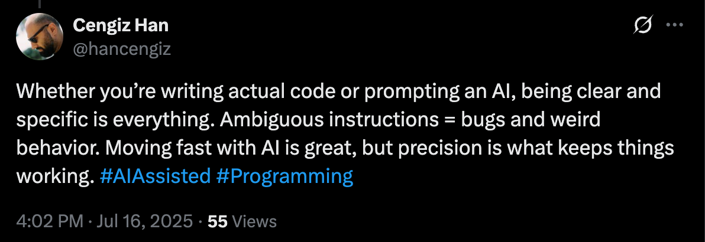

# Beyond Vibe-Coding: Spec-Driven Development

**Published:** Mon, 28 Jul 2025 12:31:48 GMT
**Author:** Cengiz Han
**Link:** [https://www.cengizhan.com/p/beyond-vibe-coding-spec-driven-development-80e80aade50e](https://www.cengizhan.com/p/beyond-vibe-coding-spec-driven-development-80e80aade50e)

---

Vibe-coding is fun. You throw an idea at the AI, see what it spits out, tweak
it, and repeat. For side projects, that's fine.

But for production systems? Real products? **Enterprises don 't ship on
vibes.**

### We're Coding in English Now. So What?

We're heading into a world where English _is_ the new interface. I've never
had to write a line of assembly code. Most devs today never see bytecode.
Pretty soon, many won't touch a traditional language either.

That doesn't make precision any less critical. It simply means it needs to be
specified earlier in the specs.

You're not writing for the compiler anymore. You're crafting a prompt for the
AI. If your prompt is unclear, the result will not only be buggy but also
incorrect in ways you'll only realize too late.

Like I said in a recent tweet:

](https://x.com/hancengiz/status/1945469135829299393)

That's the whole point. The interface might change, but the need for clarity
doesn't.

### Spec-Driven Development: Less Magic, More Alignment

Instead of jumping straight into prompts or code, I start with a spec. Simple
as that.

  * What should the system do?

  * What's out of scope?

  * What happens when something breaks?

  * What are the business rules?

This doesn't mean writing 30 pages of documentation before every sprint. A
good spec might be a short markdown file. But it's clear. It's testable. It
provides the AI (or another developer) with something to align to.

And when that spec becomes the source of truth, everything flows better: code,
tests, documentation, and even conversations.

### Amazon Kiro Is a Glimpse of What's Coming

You can already see the direction this is heading. Amazon recently launched
[Kiro](https://kiro.dev/docs/specs/concepts/), an AI agent designed to assist
in creating workflows and infrastructure But it doesn't just ask you to
describe your app. It starts with a structured spec.

Why? Because specs reduce ambiguity. They make the AI's job easier. And they
make your code more predictable. That design choice says a lot.

This spec-first mindset isn't a trend. It's a design pattern for tools that
want to build things that actually work.

[

### AI Makes Things Faster. Specs Make Them Safer.

Yes, AI can speed things up. No doubt about that. But speed without structure
is a mess waiting to happen. It's seen it play out in teams that moved fast,
skipped the alignment, and spent months cleaning up avoidable bugs.

Specs don't slow you down. They stop you from crashing later.

Having your system ready before starting to write code or prompts helps
everyone work more efficiently and reduces unexpected issues.

### TL;DR

  * Coding in English is here, but clarity still matters.

  * Prompting without structure leads to drift, bugs, and fragile systems.

  * Spec-first thinking ensures everything remains aligned, whether your team consists of humans or AI.

  * Tools like Kiro show where things are headed: structured input, reliable output.

  * Vibes are fun. Specs are how you ship.

Write the spec. Let the tools do the rest. That's how production gets done.
