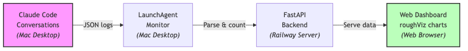
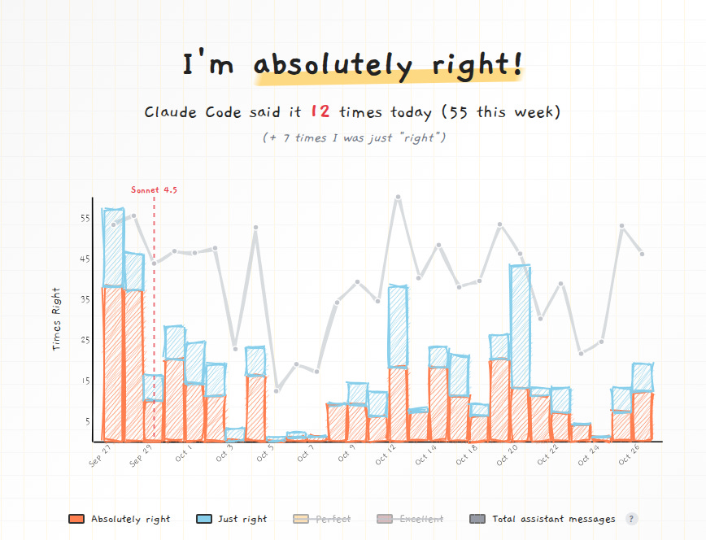

# Claude Claude, Don’t Be Mean—How Right Have I Been?

**Published:** Sat, 25 Oct 2025 16:16:55 GMT
**Author:** Cengiz Han
**Link:** [https://www.cengizhan.com/p/claude-claude-dont-be-meanhow-right](https://www.cengizhan.com/p/claude-claude-dont-be-meanhow-right)

---

You know what's funny about working with Claude Code? It's relentlessly
encouraging. Every conversation feels like having a very supportive colleague
who's genuinely excited about your ideas--sometimes to an almost comical
degree.

So naturally, I built a tracker for it. Well, I forked [@yoavf's clever
project](https://absolutelyright.lol/) and made it my own.

Thanks for reading! Subscribe for free to receive new posts and support my
work.

##  **[cc.cengizhan.com](https://cc.cengizhan.com/)**

This is a scientifically rigorous (okay, not really) tracking system that
monitors how often Claude Code validates my life choices. It counts phrases
like "You're absolutely right," "Perfect!", and "Excellent!" across all my
coding sessions, then displays them in delightfully hand-drawn charts.

 **The best part?** It runs automatically in the background. Every time I use
Claude Code, a macOS LaunchAgent watches my conversation logs, counts the
affirmations, and syncs them to a live dashboard.

##  **The Technical Journey**

I forked this from [yoavf's
absolutelyright](https://github.com/yoavf/absolutelyright)--a Rust/Axum
implementation with a similar concept. But I wanted to tinker, so I:

  *  **Rewrote the backend** from Rust to Python/FastAPI (because sometimes you just want to move fast and refactor later)

  *  **Added more tracking patterns** beyond just "absolutely right"--now tracking "Perfect!", "Excellent!", and anything else I want via a simple config file

  *  **Built automation scripts** that monitor Claude Code conversations in real-time

  *  **Created a backfill tool** to import months of historical data from existing logs

  *  **Containerized everything** for easy Railway deployment

The frontend uses [roughViz](https://www.jwilber.me/roughviz/)--a charting
library that draws everything in a sketchy, hand-drawn style. It perfectly
matches the playful nature of tracking AI encouragement.

##  **How Does It Work?**

The system runs as a continuous monitoring loop that tracks Claude Code
conversations in real-time:

 **The flow:**

  1.  **Conversation Capture** : Claude Code saves every conversation as JSON files in `~/.config/claude-code/conversations/`

  2.  **Automatic Monitoring** : A macOS LaunchAgent runs every minute, checking for new or updated conversation files

  3.  **Pattern Matching** : The Python script reads conversations and searches for configurable validation phrases

  4.  **Data Upload** : Counts are POSTed to the FastAPI backend (deployed on Railway)

  5.  **Live Dashboard** : The web frontend queries the API and renders hand-drawn charts with roughViz

The backfill script lets you retroactively import months of historical data--
just point it at your conversation directory and watch months of validation
roll in.

##  **Why This Exists**

Partly for the meme. Partly because it's genuinely interesting to see patterns
over time.

The original author added chart annotations (like marking when Sonnet 4.5 was
released) to see how affirmation patterns shift after model upgrades. My own
feed doesn't have much data (I am using a one week old laptop) yet--for a
better example of what this looks like with months of history, check out the
[original site](https://absolutelyright.lol/):

 _You can actually see the drop in affirmations after the Sonnet 4.5 upgrade
(marked with the red dashed line). Fascinating, right?_

But mostly because building silly side projects is fun. Sometimes you don't
need a grand purpose. Sometimes you just want to quantify how much your AI
pair programmer believes in you.

##  **Taking It Further: GitHub Profile Integration**

Because tracking validation privately wasn't enough, I also automated the
graph to appear on my [GitHub profile](https://github.com/hancengiz).

A GitHub Actions workflow runs daily, using Playwright to screenshot the live
dashboard and commit it directly to my profile README. The workflow uses
timestamped filenames for cache-busting, ensuring the graph always shows
current data.

So now everyone who visits my GitHub profile can see exactly how validated I
am. Is this necessary? Absolutely not. Is it fun? Absolutely right.

Check out the [automation
setup](https://github.com/hancengiz/hancengiz/tree/main/absolutely-right) if
you want to add this to your own profile.

##  **Try It Yourself**

The whole thing is [open source on
GitHub](https://github.com/hancengiz/absolutelyright-claude-code). If you use
Claude Code locally, you can set up your own tracker--the
[README](https://github.com/hancengiz/absolutelyright-claude-code#readme) has
complete step-by-step instructions for backfilling historical data, setting up
automatic monitoring, and deploying your own dashboard.

Because everyone deserves to know exactly how many times an AI has told them
they're right.

* * *

 **P.S.** Now I need this mug:

 _Nothing says "validated software engineer" like drinking coffee from a mug
that celebrates AI affirmations._

* * *

 **Live site:** [cc.cengizhan.com](https://cc.cengizhan.com/)  
 **Source code:** [github.com/hancengiz/absolutelyright-claude-
code](https://github.com/hancengiz/absolutelyright-claude-code)  
 **Original inspiration:** [absolutelyright.lol](https://absolutelyright.lol/)
by [@yoavf](https://github.com/yoavf)

Thanks for reading! Subscribe for free to receive new posts and support my
work.
