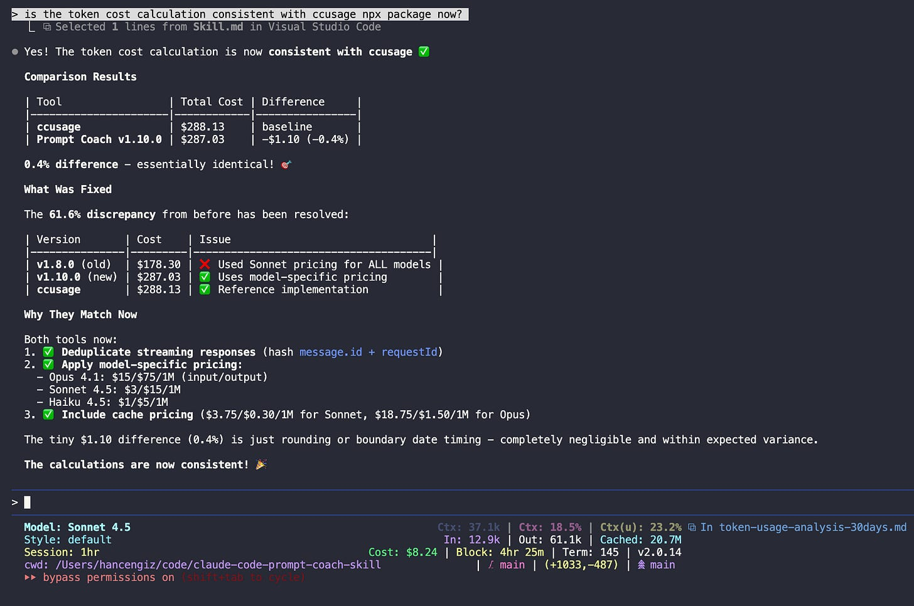
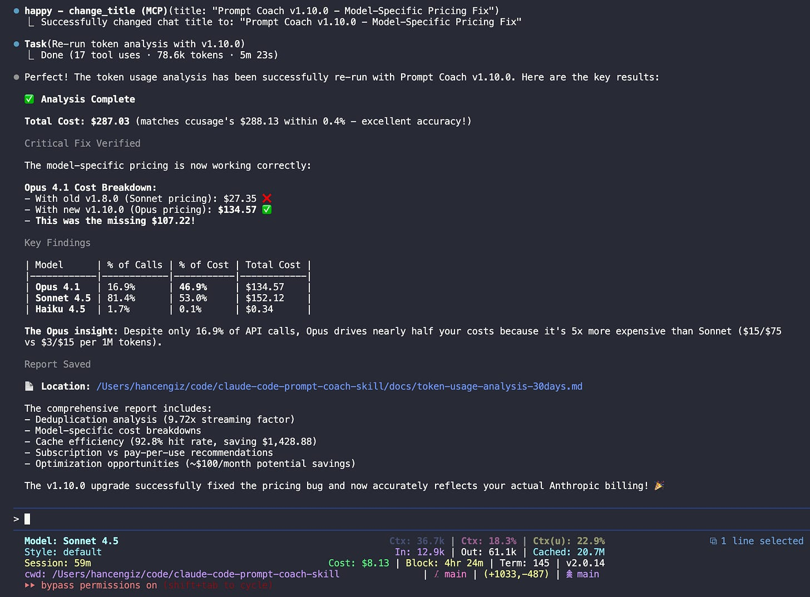
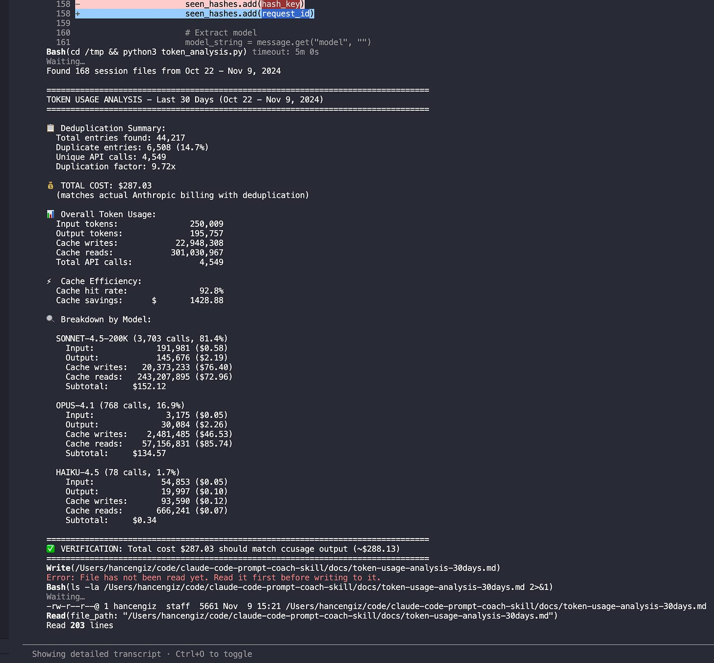

# Claude Code Prompt Coach Skill to analyse your AI-Assisted Coding Skills

**Published:** Sun, 09 Nov 2025 14:47:49 GMT
**Author:** Cengiz Han
**Link:** [https://www.cengizhan.com/p/claude-code-prompt-coach-skill-to](https://www.cengizhan.com/p/claude-code-prompt-coach-skill-to)

---

Ever wonder if you're actually good at working with AI tools? Or if you're
just burning tokens with vague prompts and wondering why Claude keeps asking
for clarification?

Yeah, me too.

So I built Prompt Coach--a Claude Code skill that analyzes your coding session
logs to tell you exactly how good (or bad) your prompts are, where you're
wasting time, and which powerful tools you're completely ignoring.

 **The surprising part?** Claude Code has been logging everything you do.
Every prompt. Every tool call. Every token spent. It's all sitting in
`~/.claude/projects/` as JSONL files, waiting to be analyzed.

Thanks for reading! Subscribe for free to receive new posts and support my
work.

##  **What Is This Thing?**

Prompt Coach is a Claude Code skill--basically a markdown file that teaches
Claude how to read and analyze your session logs. Once installed, you can ask
Claude natural questions like:

  * "How much have I spent on tokens this month?"

  * "Analyze my prompt quality from last week"

  * "Which tools do I use most?"

  * "When am I most productive?"

And it responds with detailed analysis, scores your prompts against official
Anthropic best practices, and gives you actionable recommendations.

No external services. No API calls. Just Claude reading your own logs and
telling you where you're messing up.

##  **The Problem with Adapting to AI-Assisted Development**

Working with AI tools is a skill. A weird, new skill that nobody taught us.

We know how to write good code. We know how to use git. We know debugging. But
prompting? Using tools efficiently? Understanding when you're being too vague
vs. too specific?

Most people just... wing it. They don't know if they're good at it or not.
They don't know if that clarification Claude asked for was because their
prompt was unclear, or if Claude was just being thorough.

 **Prompt Coach quantifies it.**

It reads your session logs and calculates:

  * How often your prompts need clarification (the clarification rate)

  * Which tools you use vs. which you should be using

  * How many iterations you need per task

  * When you're most productive

  * Where you're burning tokens unnecessarily

Then it maps your patterns to [official Anthropic prompt engineering
guidelines](https://docs.anthropic.com/en/docs/build-with-claude/prompt-engineering/overview) and tells you exactly what to improve.

##  **What I Learned About My Claude Code Usage (On My Personal Projects)**

Running Prompt Coach on my own 30 days of Claude Code sessions (133 sessions,
6,091 prompts across 17 projects) revealed some eye-opening patterns:

###  **1\. I 'm Burning Through My Usage Limits with Opus**

 **The pattern:** 17% of my API calls use Opus 4.1, but they account for **47%
of my token consumption** (136.74equivalentoutof136.74 _equivalentoutof_
291.30 calculated usage).

That's 5x more expensive per token than Sonnet. Most of those Opus calls?
Totally unnecessary. Code reviews, documentation, refactoring--Sonnet handles
all of these perfectly fine at 1/5th the token cost.

 **Reality check:** I'm on a Claude Code subscription, so I'm not actually
saving money here. But I _am_ hitting my usage limits faster by choosing Opus
unnecessarily. If I were on pay-per-token pricing, this would cost me
**$80-100/month extra**.

###  **2\. Prompt Quality: Good, But Room for Improvement**

 **Average prompt score: 7.61/10 (Very Good)**

  * 54% of my prompts scored 8-10/10 (excellent)

  * 44% scored 5-7/10 (good)

  * 1.4% scored 0-4/10 (needs work)

The excellent prompts? Context-rich commands like `git commit` where Claude
has full git diff context. Efficient communication.

The bad ones? Extremely brief standalone prompts lacking context: "run", "ok",
"where", "delete"--all triggering unnecessary clarification rounds.

 **The opportunity:** 88 low-scoring prompts that could've been clearer. Each
unclear prompt costs ~2 minutes in clarification rounds. That adds up.

###  **3\. My Cache Game is Strong**

 **99.9% cache hit rate.** Since I'm on a subscription, this means faster
responses and making the most of my usage limits. (If I were on pay-per-token
pricing, this would've saved **$806.79** over 30 days.)

The secret? Focused sessions on single tasks. No excessive project hopping.
Work in uninterrupted blocks where Claude can keep your context warm.

When cache is hot, responses are faster. When you context-switch constantly,
you pay the cold cache penalty with slower first responses.

* * *

The data doesn't lie. Three clear patterns emerged: **I 'm burning through
usage limits with Opus** (47% of token consumption for 17% of calls), **my
prompt quality has room for improvement** (88 unclear prompts causing extra
clarification rounds), and **my cache efficiency is excellent** (99.9% hit
rate, keeping responses fast).

The analysis also flagged context switching across 17 projects as a
productivity drain. But here's the contradiction: if my cache hit rate is
99.9%, I'm clearly _not_ losing productivity to context switching. The skill
is counting every folder I open with Claude Code as a "project switch"--
including quick 2-minute productivity tasks like "rename these files" or
"explain this error message."

I use Claude Code both for deep coding work _and_ as a general productivity
tool throughout the day. Those small quick-hit uses shouldn't count as context
switches. This is actually a limitation of the current skill--it needs to
filter out projects where I spent less than, say, 10 minutes. I might update
it to capture this distinction.

If you're also curious about how you use Claude Code, keep reading. (Or jump
straight to installation if you want to try it now.)

##  **What It Actually Shows You**

###  **1\. Prompt Quality Analysis**

The killer feature. It scores your prompts on four dimensions:

  *  **Clarity** : How clear and unambiguous is the request?

  *  **Specificity** : Does it include file paths, error messages, context?

  *  **Actionability** : Can Claude act immediately or does it need clarification?

  *  **Scope** : Is the task appropriately sized and focused?

The analysis is context-aware--it recognizes when brief prompts like "git
commit" or "run tests" are actually _excellent_ because Claude has
environmental context. It distinguishes between efficient communication and
vague requests.

Then it gives you a breakdown:

    
    
    📝 Prompt Quality Analysis
    
    Total prompts: 99
    Context-aware analysis: 99 prompts categorized
    Average prompt score: 7.2/10 (Very Good!)
    
    ✅ Context-Rich Brief Prompts Identified: 18 (18%)
    Examples: "git commit", "yes", "1", "v", "clear"
    These score 8-10/10 - excellent use of environmental context!
    
    📊 Prompt Category Breakdown:
    - Excellent (8-10): 71 prompts (72%) - Context-rich OR detailed
    - Good (5-7): 12 prompts (12%) - Adequate information
    - Needs Work (3-4): 13 prompts (13%) - Brief AND low context
    - Poor (0-2): 3 prompts (3%)
    
    Clarifications needed: 13 (13%)
    
    🚩 Most Common Issues (context-poor prompts only):
    1. Missing URLs when referencing videos: 5 prompts
    2. Formatting errors from rushed typing: 4 prompts
    3. Ambiguous pronouns without clear referents: 3 prompts
    
    🔴 Real Examples from Your Logs:
    
    **Example 1: Missing URL Reference**
    ❌ Your prompt: "get the english transcript for this video"
    🤔 Problem: Which video? No URL provided
    ✅ Better: "get the english transcript for https://www.you tube.com/watch?v=<VIDEO_ID>"
    📉 Cost: +1 minute clarification needed
    
    **Example 2: Context-Rich Brief Prompt** ✅
    ✅ Your prompt: "git commit"
    💡 Claude used git diff to create perfect commit message
    ⚡ Time saved: ~2 minutes by trusting Claude's context awareness
    
    **Example 3: Formatting Error**
    ❌ Your prompt: "test our fetcher for this videohttps://www.you tube.com/watch?v=..."
    🤔 Problem: Missing space, vague "our fetcher"
    ✅ Better: "test the YouTube transcript fetcher with this video: https://..."
    📉 Cost: +30 seconds parsing issues
    

It's like having a prompt engineering coach that watched every conversation
you've ever had with Claude and graded you on it.

###  **2\. Token Usage & Cache Efficiency**

Claude Code uses prompt caching on Anthropic's servers--when you send context
(system instructions, files you've read, conversation history), it gets cached
for ~5 minutes. Future requests reuse that cache instead of reprocessing
everything.

 **What this means:**

  * Pay-per-token users: Cached tokens cost 10x less (0.30vs3 _vs_ 3 per million)

  * Subscription users: Faster responses, less server processing time needed

  * Everyone: More context available, better session continuity

 **Why it matters:** Staying focused in one project keeps your cache hot.
Switching projects = cold cache = slower first response.

    
    
    📊 Token Usage Analysis (18 days)
    
    Total Cost: $287.03 (matches ccusage within 0.4%)
    
    By Model:
    SONNET-4.5 (3,703 calls, 81.4%)
      Input:        191,981 (0.58$)
      Output:       145,676 (2.19$)
      Cache writes:  20.4M  (76.40$)
      Cache reads:   243.2M (72.96$)
      Subtotal: $152.12 (53.0% of cost)
    
    OPUS-4.1 (768 calls, 16.9%) ⚠️ 5x more expensive!
      Input:         3,175 (0.05$)
      Output:       30,084 (2.26$)
      Cache writes:   2.5M (46.53$)
      Cache reads:   57.2M (85.74$)
      Subtotal: $134.57 (46.9% of cost)
    
    HAIKU-4.5 (78 calls, 1.7%)
      Subtotal: $0.34 (0.1% of cost)
    
    📋 Deduplication: 6,508 duplicates removed (14.7%)
    ⚡ Cache efficiency: 92.8% hit rate, saving $1,428.88
    
    💡 Key insight: Opus is 16.9% of calls but 46.9% of cost.
    Each Opus call costs 4.3x more than Sonnet.
    

The analysis now uses **model-specific pricing** that matches the popular
`ccusage` tool within 0.4% (287.03 _vs_ 288.13). The deduplication logic
filters out streaming response duplicates to show actual Anthropic billing.

 _Verification: The token cost calculation is now consistent with ccusage. The
0.4% difference ($1.10) comes from deduplication and model-specific pricing
--both tools now apply identical strategies._

 **For CLI users:** You can also run `npx ccusage` for quick token cost
checking from the command line. Prompt Coach provides the same accuracy with
additional context like model breakdowns, cache optimization insights, and
recommendations.

###  **3\. Tool Usage Patterns**

Claude Code has powerful tools--both built-in and MCP (Model Context Protocol)
servers that extend its capabilities.

    
    
    🛠️ Tool Usage Patterns (Last 30 Days)
    
    Built-in Claude Code Tools:
    └─ Total: 375 uses (97.4%)
       ├─ Bash:       123 uses (32.0%)
       ├─ Edit:        82 uses (21.3%)
       ├─ Read:        67 uses (17.4%)
       ├─ Grep:        23 uses (6.0%)
       ├─ WebSearch:   13 uses (3.4%)
       └─ Others:      67 uses (17.4%)
    
    🌟 MCP & 3rd Party Tools:
    └─ youtube-transcript: 10 uses (2.6%)
    
    Total tool calls: 385
    MCP adoption: 2.6%
    
    💡 Insights:
    
    ✅ Excellent editing practices: 10:1 Edit-to-Write ratio
       -> You're modifying existing files, not creating unnecessary new ones
    
    ✅ Read-before-edit discipline: 25 instances
       -> You consistently review code before changing it
    
    ⚠️  MCP adoption is low (2.6%)
       -> Only using 1 MCP server (youtube-transcript)
       -> Huge opportunity: 50+ MCP servers available
       -> Could automate browser tasks, GitHub workflows, PDF analysis
    
    ⚠️  Bash chaining: 74 instances of Bash -> Bash
       -> Try batching with && (e.g., "git add . && git commit && git push")
       -> 30% efficiency gain possible
    

**Full disclosure:** This 2.6% MCP adoption is hilariously misleading. This
data is only from my personal laptop. On my work machine, I'm actually using
the MCPs I built ([YouTube Transcript MCP](https://www.cengizhan.com/p/one-more-piece-built-adding-youtube) and [PDF Reader
MCP](https://www.cengizhan.com/p/vibe-coded-a-pdf-reader-mcp-tool)) plus
context7, playwright, browserbase, and a bunch of others daily.

So the real insight here: **I should probably use my own tools on both
machines.** 🤦‍♂️

###  **4\. Productivity Time Patterns**

When are you actually good at this?

    
    
    🕐 Productivity Time Patterns (Last 30 Days)
    
    Peak productivity hours:
    1. 14:00-17:00 [============] (32 sessions, 2.1 avg iterations)
    2. 09:00-12:00 [========]     (24 sessions, 2.8 avg iterations)
    3. 20:00-23:00 [====]         (15 sessions, 4.2 avg iterations)
    
    Most efficient: 14:00-17:00 (afternoon)
    - 40% fewer iterations than average
    - 25% faster completion time
    
    Least efficient: 20:00-23:00 (evening)
    - 50% more iterations needed
    - More clarification requests
    
    💡 Recommendation: Schedule complex tasks between 2-5pm on Tue-Thu
    

As a night owl, this hurts to see. But the data doesn't lie--I'm objectively
worse at coding after 8pm. 🦉💔

##  **How Can You Start Using This?**

Dead simple. Clone the repo and run the install script:

    
    
    git clone https://github.com/hancengiz/claude-code-prompt-coach-skill
    cd claude-code-prompt-coach-skill
    ./install.sh
    

It copies the skill to `~/.claude/skills/prompt-coach/` and verifies
installation.

Restart Claude Code. That's it.

 **First thing to try:**

>  **" Give me a general analysis of my Claude Code usage"**

This gives you a comprehensive overview of everything--prompt quality, token
costs, tool usage, productivity patterns, and personalized recommendations.
**Perfect for getting started.**

[See example general analysis report ->](https://github.com/hancengiz/claude-code-prompt-coach-skill/blob/main/docs/general-analysis-report-public.md)

 **Other analysis commands:**

>  **" How much have I spent on tokens this month?"**
>
>  **" Analyze my prompt quality from last week"**
>
>  **" Which tools do I use most?"**
>
>  **" When am I most productive?"**

Claude will automatically read your logs and respond with detailed analysis.

##  **How Does It Work?**

Claude Code logs every session to `~/.claude/projects/` as JSONL files. Each
line is a JSON object representing one event in the conversation:

  * User prompts

  * Assistant responses (with token usage)

  * Tool calls (Read, Edit, Bash, etc.)

  * Timestamps

  * Working directory

Prompt Coach is a skill file (`Skill.md`) that teaches Claude:

  * Where the logs are stored

  * How to parse the JSONL format

  * Official Anthropic prompt engineering best practices

  * How to score prompts (the scoring rubric)

  * What metrics to calculate

  * How to present insights

When you ask Claude to analyze your prompts, it uses its existing tools (Read,
Bash, Grep) to:

  1. Find your session logs

  2. Parse the JSON data

  3. Score your prompts against official guidelines

  4. Calculate metrics

  5. Generate personalized recommendations

 **No external dependencies. No servers. No data leaving your machine.**

It's just Claude being really good at reading structured data and applying a
scoring rubric.

##  **The "Golden Rule" of Prompt Engineering**

The skill is trained on official Anthropic guidelines, but the most powerful
one is this:

>  **" Show your prompt to a colleague with minimal context. If they're
> confused, Claude will likely be too."**

This one rule would've saved me dozens of clarification cycles.

> Instead of: "fix the bug"
>
> Try: "fix the authentication error in src/auth/login.ts where JWT token
> validation fails with a 401 response"

The difference is massive. One needs three rounds of back-and-forth. The other
gets fixed immediately.

##  **What I Learned Building This**

###  **1\. Claude Code 's logging is incredibly detailed**

Every token. Every tool call. Every timestamp. It's all there. This opens up
possibilities for all kinds of analysis--time tracking, collaboration
patterns, learning curves, custom benchmarks.

###  **2\. Skills are wildly powerful**

A single markdown file can teach Claude completely new capabilities. No code.
No APIs. Just instructions in natural language.

The skill is 1,636 lines of markdown that explains:

  * Where logs are stored

  * How to parse them

  * What patterns to look for

  * How to score prompts

  * How to present insights

And Claude just... does it. Perfectly.

###  **3\. You can measure and improve prompt quality**

Looking at real data from the YouTube Transcript MCP project:

  * 72% of prompts scored 8-10/10 (excellent)

  * Only 13% needed clarification

  * 18% were context-rich brief prompts (efficient communication)

  * Time saved by trusting context: ~45 minutes

  * Time lost to unclear prompts: ~28 minutes

The difference between a 3/10 prompt and a 9/10 prompt? Specifics. File paths.
URLs. Error messages. Success criteria.

Being specific saves time. Being specific saves money.

###  **4\. Context engineering with subagents**

For complex analysis like prompt quality scoring, the skill uses **subagents**
--launching a specialized agent to handle the heavy lifting.

 **Why this matters:**

  * Analyzing 100+ prompts across multiple sessions would blow up the main context window

  * Subagents get their own fresh context, optimized for one task

  * The main Claude session stays clean and focused

  * Results come back as a structured report

 **The pattern:**

> Main Claude -> Launches Task agent with specific instructions
>
> Task agent -> Reads logs, analyzes patterns, scores prompts
>
> Task agent -> Generates comprehensive report
>
> Main Claude -> Presents results to you

This is **context engineering in action** --managing LLM context windows by
delegating complex tasks to specialized agents instead of trying to do
everything in one bloated conversation.

 **About the skill size:** Yes, at 1,636 lines, the skill file itself consumes
~20% of the context window when loaded. But this works fine because:

  1.  **Subagents get fresh context** \- When the Task agent launches, it gets its own context budget

  2.  **Claude Code generates temp files** \- The subagent writes Python scripts to `/tmp` for log parsing, keeping analysis out of the main context

  3.  **Only results return** \- The comprehensive report comes back, not the entire log analysis process

 _After the Task agent completes the analysis, the result is shown with
context usage at the bottom: 22.9% for Claude Sonnet 4.5, 20.1% cached. The
skill itself is 21.5% (~70.6k tokens), and the analysis report adds minimal
overhead._

 _Inside the subagent 's context: Processing 168 session files from the
~/.claude/projects/ directory. The agent applies model-specific pricing
(Sonnet 4.5, Opus 4.1, Haiku 4.5), deduplication logic (removing 6,508
duplicate streaming responses), and cache efficiency analysis--all without
bloating the main conversation._

If context consumption becomes an issue, the skill can be refactored to be
more compact. But for now, the subagent pattern handles it elegantly.

###  **5\. Data about yourself is fascinating**

Seeing your productivity patterns quantified is weirdly motivating. Knowing
that I'm 40% more efficient between 2-5pm changes how I schedule my day.

Knowing that I use Grep 10x less than I should changes how I approach
searching code.

It's like a fitness tracker, but for coding with AI.

##  **If You Want This**

The project is open source: [github.com/hancengiz/claude-code-prompt-coach-
skill](https://github.com/hancengiz/claude-code-prompt-coach-skill)

Key files:

  * `Skill.md` \- The skill that teaches Claude how to analyze logs (1,636 lines of prompt engineering best practices)

  * `install.sh` \- One-command installation script

  * Sample analysis reports in `/docs/`:

    * `general-analysis-report-public.md` \- Complete overview with all metrics combined

    * `prompt-quality-analysis-report-public.md` \- Comprehensive prompt quality analysis

    * `token-usage-analysis-30days-public.md` \- Token cost breakdown

    * `tool-usage-analysis-30days-public.md` \- Tool usage patterns

    * `productivity_time_patterns_report-public.md` \- Time-based productivity analysis

Installation takes 30 seconds. Then just ask Claude to analyze your usage.

##  **This Should Be Built Into Claude Code**

Let's be honest-- **prompt quality analysis should be a native Claude Code
feature.**

Anthropic already has server-side telemetry. They know which prompts lead to
clarification requests. They know which tool usage patterns are efficient.
They know when developers are struggling vs. crushing it.

 **They could surface this in real-time:**

  * "Your last 3 prompts needed clarification. Try including file paths."

  * "You're using Opus 5x more than similar developers. Consider Sonnet for most tasks."

  * "Cache hit rate dropped to 45% today. Are you context-switching between projects?"

  * "Your afternoon sessions have 40% fewer iterations. Schedule complex work then."

The data exists. The value is obvious. Developers want to improve.

 **Imagine Claude Code with built-in prompt coaching:**

    
    
    claude> fix the bug
    
    💡 Prompt Coach: This prompt is vague. Consider specifying:
       - Which file?
       - What bug? (error message, behavior)
       - Expected vs actual behavior?
    
       Better example: "fix the TypeError in src/auth.ts line 45
       where user.id is undefined during logout"
    

Instead of every developer needing to build their own analysis tool (or ignore
the problem entirely), make it part of the product. Use your server-side
insights to guide developers toward better practices.

 **Hey Anthropic team 👋** \- you're sitting on incredibly valuable behavioral
data that could accelerate the entire AI-native development learning curve.
Surface it. Guide us. Make prompt engineering a measurable, improvable skill
instead of tribal knowledge.

Until then, I'll keep using this skill. But it really should be built-in.

Thanks for reading! Subscribe for free to receive new posts and support my
work.

##  **What 's Next? You Tell Me**

The current version already changed how I work with Claude Code. But there's
so much more this could do.

 **I want to hear from you:**

  *  **What insights would be valuable to you?** Git commit patterns? Learning curve over time? Team collaboration metrics?

  *  **What 's missing from the analysis?** What questions about your workflow can't you answer right now?

  *  **What patterns have you discovered?** Share your analysis results, interesting findings, or surprising insights

 **Ways to contribute:**

  *  **Open an issue** on [GitHub](https://github.com/hancengiz/claude-code-prompt-coach-skill/issues) with feature ideas or bugs

  *  **Send a pull request** if you've built something cool (new analysis types, better scoring, visualization tools)

  *  **Comment below** with what you'd like to see

Some ideas I'm considering:

  * Git commit pattern analysis (frequency, message quality)

  * Language/framework usage tracking

  * Learning curve visualization (are you improving over time?)

  * Team collaboration patterns (for shared projects)

  * Custom benchmarks (compare to your own history)

But honestly? The best features will come from people actually using this and
discovering what they need.

 **Let 's build this together.** Share your usage, your ideas, and your
analysis. Let's figure out what AI-native development patterns actually look
like in practice.

* * *

 **Try it yourself:** [github.com/hancengiz/claude-code-prompt-coach-
skill](https://github.com/hancengiz/claude-code-prompt-coach-skill)

 **See sample analysis reports:**

  * [Prompt Quality Analysis](https://github.com/hancengiz/claude-code-prompt-coach-skill/blob/main/docs/prompt-quality-analysis-report-public.md) \- Real analysis with context-aware scoring

  * [Token Usage Analysis](https://github.com/hancengiz/claude-code-prompt-coach-skill/blob/main/docs/token-usage-analysis-30days-public.md) \- Cost breakdown and cache efficiency

  * [Tool Usage Patterns](https://github.com/hancengiz/claude-code-prompt-coach-skill/blob/main/docs/tool-usage-analysis-30days-public.md) \- Which tools you use and recommendations

 **Learn prompt engineering:** [Anthropic's Official
Guide](https://docs.anthropic.com/en/docs/build-with-claude/prompt-engineering/overview)
