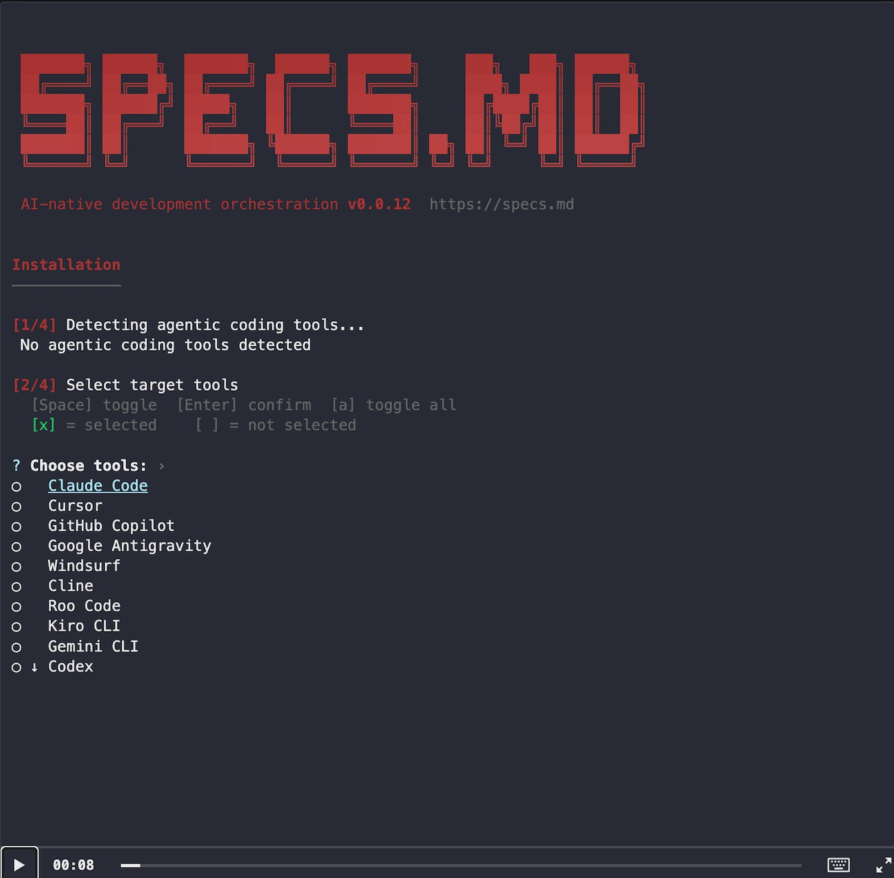

# Announcing specs.md: Structure for AI-Native Development

**Published:** Wed, 24 Dec 2025 21:47:04 GMT
**Author:** Cengiz Han
**Link:** [https://www.cengizhan.com/p/announcing-specsmd-structure-for](https://www.cengizhan.com/p/announcing-specsmd-structure-for)

---

# **[https://specs.md](http://specs.md/)**

 **TL;DR:** Vibe-coding works for side projects. But production systems need
more.  
[specs.md](http://specs.md/) brings the _Explore -> Specify -> Engineer_ loop
into your AI coding workflow.  
It's open source, in alpha, and I'm looking for feedback from engineers who
care about building things that actually work.

* * *

##  **The Problem We All Know**

I've seen it happen dozens of times.

You start with AI--throw prompts, get code, iterate fast. It works. Until it
doesn't.

The AI forgets context between sessions. You're re-explaining your
architecture every time. Code quality swings wildly. Nobody remembers why
decisions were made. Debugging becomes archaeology.

 **Vibes got you here. Vibes won 't get you to production.**

The spec-first crowd says "write everything down before you start." But that's
just as broken--specs written before learning are guesses dressed up as
documentation.

What actually works is the loop: **explore freely, specify what you learned,
then engineer with rigor.**

That's what [specs.md](http://specs.md/) does.

* * *

##  **What Is[specs.md](http://specs.md/)?**

[specs.md](http://specs.md/) is an open-source framework that implements **AI-
DLC** (AI-Driven Development Lifecycle)--a methodology that came out of AWS
for AI-native software development.

It gives you:

  *  **Specialized agents** for each phase--Inception, Construction, Operations

  *  **Memory Bank** --persistent context that survives across sessions

  *  **Human gates** --validation checkpoints that catch errors before they cascade

  *  **Standards you define once** --tech stack, coding conventions, architecture patterns

It plugs into the tools you already use: Claude Code, Cursor, GitHub Copilot.

* * *

##  **How It Works**

You don't start by prompting blindly. You start by capturing intent.

    
    
    /specsmd-master-agent
    

The Master Agent asks: what are you building?

From there:

  1.  **Inception Agent** elaborates your goal into requirements, user stories, and system context

  2.  **Construction Agent** executes bolts--time-boxed sessions with validated stages

  3.  **Operations Agent** handles deployment and monitoring

Every artifact gets stored in a file-based Memory Bank. Readable by humans.
Parseable by AI. Context that persists.

Here's what it looks like in action:

* * *

##  **Why This Matters**

Because AI amplifies whatever you give it.

Feed it chaos, you get faster chaos.  
Feed it structure, you get faster delivery.

[specs.md](http://specs.md/) doesn't slow you down. It stops you from crashing
later.

The human gates aren't bureaucracy--they're the 30% that makes AI output
production-ready. You review at each stage. Errors get caught early, before
they cascade downstream.

* * *

##  **It 's Alpha--I Need Your Feedback**

This is early. Some things work well. Some things don't yet.

The Operations Agent has known issues I'm actively fixing. The framework is
evolving based on real usage.

I'm not looking for users who want a polished product. I'm looking for
**opinionated engineers** who want to shape how AI-native development actually
works in practice.

If you've felt the pain of vibe-coding at scale--if you've seen promising AI
experiments fail when they hit production--I want to hear from you.

* * *

##  **Get Started**

    
    
    npx specsmd@latest install
    

Then open your AI coding tool and type:

    
    
    /specsmd-master-agent
    

**Links:**

  * Documentation: [specs.md](https://specs.md/)

  * GitHub: [github.com/fabriqaai/specsmd](https://github.com/fabriqaai/specsmd)

  * Report issues: [GitHub Issues](https://github.com/fabriqaai/specsmd/issues)

* * *

Vibes are fun. Specs are how you ship.

Let's build the next generation of engineering, together.

Thanks for reading cengizhan.com! Subscribe for free to receive new posts and
support my work.
