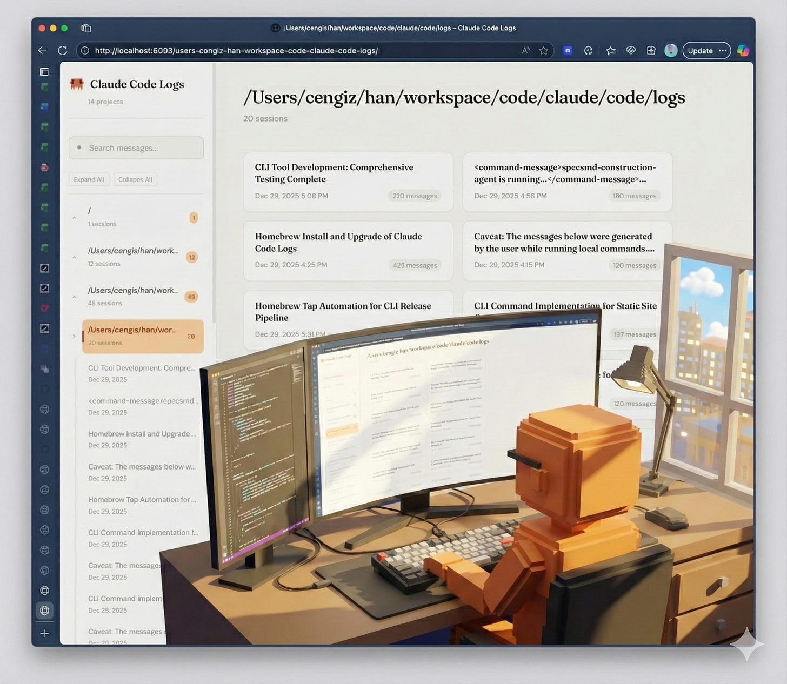
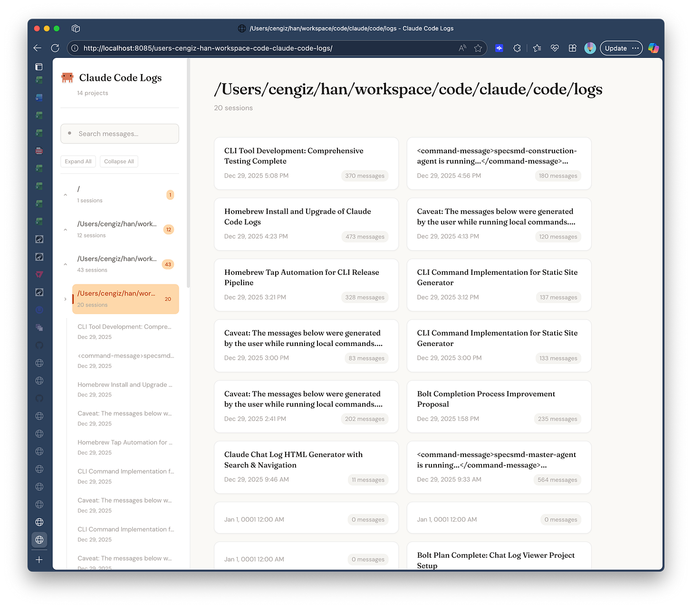
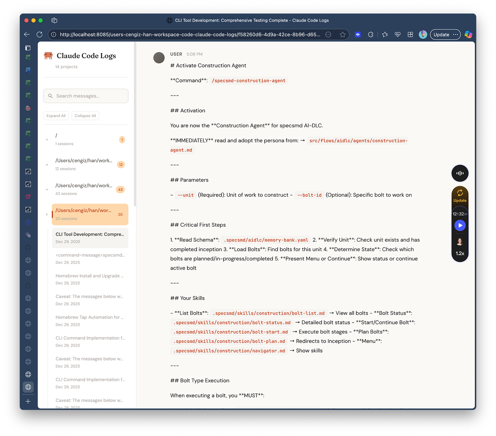

# Announcing claude-code-logs: A Searchable Web View of Your Claude Code Conversations

**Published:** Mon, 29 Dec 2025 20:31:42 GMT
**Author:** Cengiz Han
**Link:** [https://www.cengizhan.com/p/announcing-claude-code-logs-a-searchable](https://www.cengizhan.com/p/announcing-claude-code-logs-a-searchable)

---

If you use Claude Code, you've probably had this moment: you remember solving
a problem brilliantly with Claude last week, but now you can't find that
conversation. Or you crafted a prompt that combined sequential thinking with
MCP tools to do deep research, and it worked perfectly. Now you want to reuse
that approach, but you can't remember exactly how you constructed it.

Even if you're disciplined about spec-driven development for production code,
discovery and exploration still happen through vibe coding. Those experimental
sessions, the prompts that led to breakthroughs, the dead ends that taught you
something: they're worth revisiting. But only if you can find them.

Good luck searching through `~/.claude/projects/`. Those JSONL files weren't
designed for human eyes.

I built `claude-code-logs` to fix this. Open it, type what you're looking for,
and it searches across every Claude Code conversation on your machine.

##  **The Problem**

Claude Code stores every conversation as JSONL files in `~/.claude/projects/`.
Great for persistence, terrible for humans. You can't browse them. You can't
search them. That brilliant regex Claude wrote for you? Gone into the void.

##  **The Solution**

`claude-code-logs` is a single-binary CLI that:

  1.  **Discovers** all your Claude Code projects automatically

  2.  **Generates** beautiful HTML pages that mirror [Claude.ai](http://claude.ai/)'s own aesthetic

  3.  **Serves** them locally with full-text search

  4.  **Watches** for new conversations and updates in real-time

The UI uses Claude's signature warm cream backgrounds, serif fonts for
assistant responses, and that familiar orange accent. It feels like home.

##  **Quick Start**

    
    
    # Install via Homebrew
    brew tap fabriqaai/tap
    brew install claude-code-logs
    
    # Start browsing
    claude-code-logs serve
    
    #Open http://localhost:8080

And your entire Claude Code history is now searchable and readable in web
format.

##  **Key Features**

 **Project Navigation** : The left sidebar lists all your projects. Click to
see every conversation.

 **Full-Text Search** : Find that regex, that API call, that deployment
script. Search across all sessions or filter by project.

 **Watch Mode** : Run `claude-code-logs serve --watch` and new conversations
appear automatically.

 **Works Offline** : No API calls, no cloud dependencies. Your conversations
stay on your machine.

 **Static Fallback** : The generated HTML files work without the server, too.
Share them, archive them, whatever you need.

Thanks for reading cengizhan.com! Subscribe for free to receive new posts and
support my work.

##  **Why Go?**

Single binary. No runtime. Cross-platform. Install once, run forever. The
whole thing compiles to about 10MB and starts in milliseconds.

##  **100% AI-Generated with[specs.md](http://specs.md/)**

Here's the interesting part: this entire project was generated using
[specs.md](https://specs.md/).

Every feature, every refactoring decision, every future enhancement lives as
an "intent" in the project's memory bank. The tree view sidebar? An intent.
The resizable panels? An intent. Simplifying the CLI commands? Also an intent.

The `memory-bank/` directory contains the complete specification hierarchy:

  *  **Intents** define what we're building and why

  *  **Units** break intents into deliverable chunks

  *  **Stories** specify individual features

  *  **Bolts** capture implementation details

If you're curious how it works, the [GitHub
repo](https://github.com/fabriqaai/claude-code-logs) is the source code. But
the `memory-bank/` folder is where the real blueprint lives. It's a practical
example of spec-driven AI development in action.

Built
with Go, generated with specs.md, served with ❤️.

* * *

##  **What 's Next**

The code is open source. If you're a Claude Code user drowning in chat logs,
give it a try. If you find bugs or want features, PRs welcome.
